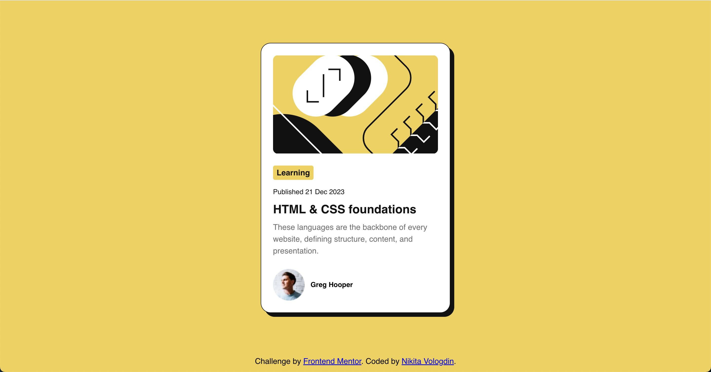
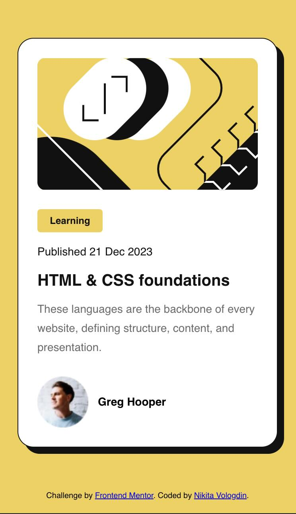
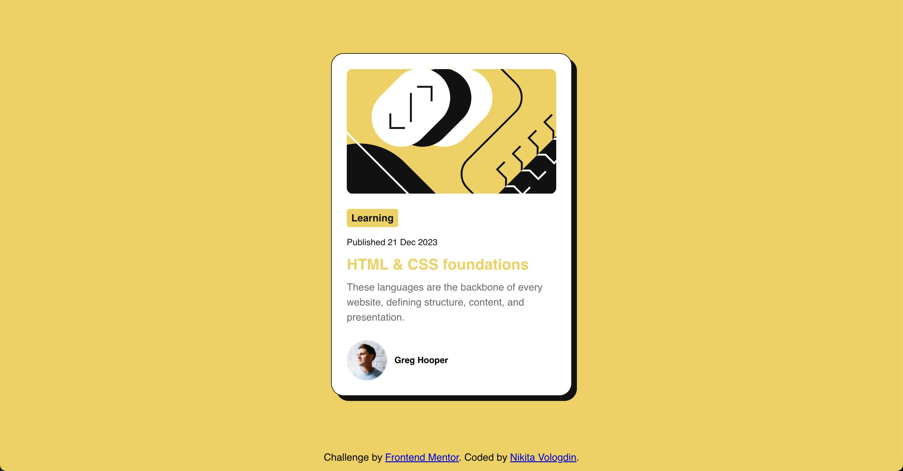

# Frontend Mentor - Blog preview card solution

This is a solution to the [Blog preview card challenge on Frontend Mentor](https://www.frontendmentor.io/challenges/blog-preview-card-ckPaj01IcS). Frontend Mentor challenges help you improve your coding skills by building realistic projects.

## Table of contents

- [Overview](#overview)
  - [Screenshot](#screenshot)
  - [Links](#links)
  - [Built with](#built-with)
  - [What I learned](#what-i-learned)
- [Author](#author)

**Note: Delete this note and update the table of contents based on what sections you keep.**

## Overview

This blog card component is a versatile and responsive element designed to showcase blog post content in an engaging and visually appealing way. Built with HTML and CSS, it offers the following key features:

- First Responsive Design: Utilizes media queries to adapt seamlessly to various screen sizes, ensuring optimal user experience across devices.
- Second Accessibility: Prioritizes accessibility by implementing features like alternative text for images and maintaining proper color contrast for optimal readability.
- Third Hover Effect: Includes a smooth hover effect that enhances interactivity and user engagement.
- Fourth Drop Shadow: Adds a subtle depth and visual interest to the card design.
  This component is well-suited for various blog layouts and effectively grabs the user's attention while presenting blog content in a clear and concise manner.

### Screenshots

### Links

- Solution URL: [github](https://github.com/NikitaVologdin/blog-card-preview)
- Live Site URL: [live](https://blog-card-preview-phi.vercel.app/)

### Built with

- Semantic HTML5 markup
- CSS custom properties
- Flexbox
- Mobile-first workflow

### What I learned

Improved understanding of drop-shadow function.

## Author

- Website - [Nikita Vologdins](https://www.vologdin.eu)
- Frontend Mentor - [@NikitaVologdin](https://www.frontendmentor.io/profile/NikitaVologdin)
